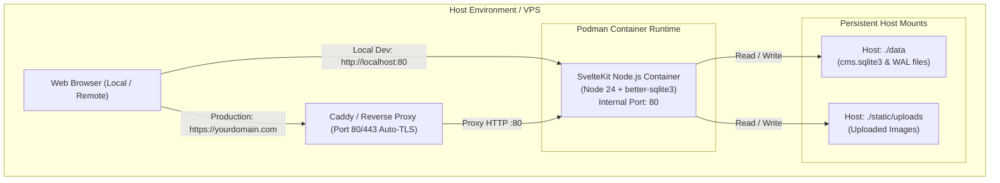

# Requirements

### Overview & Goals
Package the SvelteKit CMS application into a production-ready **Podman container** with full support for local development, rapid local verification in the browser, and automated zero-downtime deployment to a VPS (Linode) or cloud environment (AWS).

### Scope
- **In Scope**:
  - Multi-stage `Containerfile` optimized for Node.js 24 and native C++ compilation of `better-sqlite3`.
  - `.containerignore` / `.dockerignore` to optimize build context and cache invalidation.
  - `podman-compose.yml` for single-command local container orchestration.
  - Step-by-step instructions for building, running, mounting persistent volumes, and accessing the running application in the browser (`http://localhost:80` or `http://localhost`).
  - Production deployment readiness: persistent host directories for SQLite database (`data/cms.sqlite3`) and image uploads (`static/uploads/`), rootless user isolation, and reverse proxy auto-TLS configuration.
  - Automated GitHub Actions workflow (`.github/workflows/deploy.yml`) for linting, testing, container building/pushing to GHCR, and automated SSH deployment to a VPS host.
  - SQLite backup and operational maintenance guide.
- **Out of Scope**:
  - Distributed multi-node database clustering (SQLite is an embedded single-node database).
  - Heavy Kubernetes cluster manifests (unnecessary overhead for a single-admin CMS).

### User Stories & Acceptance Criteria
- **Local Container Execution**: As a developer, I can run a single command (`podman-compose up` or `podman run ...`) to spin up the production container and immediately view the site at `http://localhost:80` (or `http://localhost`) in my web browser.
- **Persistent Data & Uploads**: Any CMS content changes made via `/admin` or images uploaded to `static/uploads/` persist across container rebuilds and restarts via host bind-mounts.
- **First-Run CMS Setup**: Launching a fresh container automatically applies database migrations and presents the `/admin/setup` onboarding workflow when no admin user exists.
- **Production Readiness**: The container image runs as an unprivileged user (`nodejs`), exposes clean health check endpoints, respects environment configuration, and deploys cleanly to any Linux VPS or container host.

# Technical Design

### Current Implementation Context
- **Runtime**: SvelteKit 2 running on Node.js 24 with `@sveltejs/adapter-node` generating a standalone production server in `build/`.
- **Database**: SQLite managed by `better-sqlite3` located at `data/cms.sqlite3` with WAL mode enabled.
- **Uploads**: User-uploaded images stored in `static/uploads/` and served at `/uploads/*`.
- **Environment**: Runtime parameters loaded via environment variables (`PORT`, `HOST`, `ORIGIN`, `BODY_SIZE_LIMIT`, `SMTP_*`).

---

### Key Decisions

1. **Two-Stage Multi-Architecture Containerfile**:
   - *Decision*: Build inside `node:24-bookworm-slim` with build tools (`python3`, `make`, `g++`), then copy only compiled `build/`, `static/`, and pruned production `node_modules/` into a minimal runtime stage.
   - *Rationale*: `better-sqlite3` requires native C++ compilation during `npm ci`. Isolating build dependencies to Stage 1 keeps the final image lightweight (<150MB) and attack surface minimal.

2. **Rootless User & Permission Architecture**:
   - *Decision*: Create an unprivileged user (`nodejs`, UID/GID `1001`) inside the container and ensure ownership of persistent mount points (`/app/data` and `/app/static/uploads`).
   - *Rationale*: Ensures rootless Podman execution security; even if the container is compromised, the attacker gains no host privileges.

3. **SELinux-Compatible Persistent Bind Mounts**:
   - *Decision*: Use volume flags `./data:/app/data:Z` and `./static/uploads:/app/static/uploads:Z` in compose and CLI launch commands.
   - *Rationale*: The `:Z` flag configures private unshared SELinux labels required for rootless Podman on Fedora, RHEL, and Debian/Ubuntu systems with AppArmor/SELinux enabled.

4. **Port Mapping & Network Exposure**:
   - *Decision*: Expose container port `80` and map to host `127.0.0.1:80` (or `80:80`) for local testing or reverse-proxy routing.
   - *Rationale*: Standard HTTP port for web traffic; production traffic flows securely either directly or through a reverse proxy (Caddy/Nginx) handling SSL/TLS.

---

### Container Architecture Diagram



---

### Container Specifications

#### 1. `Containerfile` (or `Dockerfile`)
```dockerfile

# ------------------------------------------------------------------------------

# Stage 1: Build Stage

# ------------------------------------------------------------------------------

FROM node:24-bookworm-slim AS builder

WORKDIR /app

# Install native compilation dependencies for better-sqlite3

RUN apt-get update && apt-get install -y --no-install-recommends \
    python3 \
    make \
    g++ \
    && rm -rf /var/lib/apt/lists/*

# Copy dependency manifests

COPY package.json package-lock.json ./

# Install all dependencies (including devDependencies needed for build)

RUN npm ci

# Copy application source code

COPY . .

# Run type check, unit tests, and compile SvelteKit production bundle

RUN npm run check
RUN npm run build
RUN npm prune --omit=dev

# ------------------------------------------------------------------------------

# Stage 2: Runtime Stage

# ------------------------------------------------------------------------------

FROM node:24-bookworm-slim AS runner

WORKDIR /app

ENV NODE_ENV=production \
    PORT=80 \
    HOST=0.0.0.0 \
    BODY_SIZE_LIMIT=52428800

# Create unprivileged user and storage directories

RUN groupadd -g 1001 nodejs && \
    useradd -u 1001 -g nodejs -m nodejs && \
    mkdir -p /app/data /app/static/uploads && \
    chown -R nodejs:nodejs /app

# Copy production runtime artifacts

COPY --from=builder --chown=nodejs:nodejs /app/package.json ./
COPY --from=builder --chown=nodejs:nodejs /app/node_modules ./node_modules
COPY --from=builder --chown=nodejs:nodejs /app/build ./build
COPY --from=builder --chown=nodejs:nodejs /app/static ./static

USER nodejs

EXPOSE 80

VOLUME ["/app/data", "/app/static/uploads"]

HEALTHCHECK --interval=30s --timeout=5s --start-period=5s --retries=3 \
  CMD node -e "fetch('http://localhost:80/').then(r => r.ok ? process.exit(0) : process.exit(1)).catch(() => process.exit(1))"

CMD ["node", "build"]
```

#### 2. `.containerignore` / `.dockerignore`
```ignore
node_modules
.svelte-kit
build
data/*.sqlite3*
data/*.sqlite*
static/uploads/*
!static/uploads/.gitkeep
.git
.github
.junie
tests
.env
.env.local
*.log
```

#### 3. `podman-compose.yml`
```yaml
version: '3.8'

services:
  mysite:
    image: mysite:latest
    build:
      context: .
      dockerfile: Containerfile
    container_name: mysite-app
    restart: unless-stopped
    ports:
      - "80:80"
    userns_mode: keep-id
    env_file:
      - .env
    volumes:
      - ./data:/app/data:Z
      - ./static/uploads:/app/static/uploads:Z
```

# Local Execution & Browser Guide

### Quick Start: Launching Locally in 3 Steps

#### Method A: Using Podman Compose (Recommended)

1. **Ensure environment file exists**:
   ```bash
   cp -n .env.example .env
   ```

2. **Build and start the container**:
   ```bash
   podman-compose up --build -d
   ```
   *(or `podman compose up --build -d` depending on your Podman version).*

3. **Open in your Web Browser**:
   - **Frontend Site**: Navigate to [http://localhost:80](http://localhost:80) (or [http://localhost](http://localhost))
   - **Admin Setup**: Navigate to [http://localhost:80/admin/setup](http://localhost:80/admin/setup) (or [http://localhost/admin/setup](http://localhost/admin/setup)) to create your admin account and save your emergency recovery code.
   - **Admin Dashboard**: Navigate to [http://localhost:80/admin](http://localhost:80/admin) (or [http://localhost/admin](http://localhost/admin)) to log in and manage content.

---

#### Method B: Using Podman CLI Directly

1. **Build the container image**:
   ```bash
   podman build -t mysite:latest -f Containerfile .
   ```

2. **Run the container with persistent volumes and port mapping**:
   ```bash
   # Ensure local host directories exist
   mkdir -p data static/uploads

   # Launch container
   podman run -d \
     --name mysite-app \
     --userns=keep-id \
     -p 80:80 \
     --env-file .env \
     -v ./data:/app/data:Z \
     -v ./static/uploads:/app/static/uploads:Z \
     mysite:latest
   ```

3. **Check logs and status**:
   ```bash
   # View container logs in real time
   podman logs -f mysite-app

   # Check container status
   podman ps
   ```

4. **Access in browser**:
   - Visit [http://localhost:80](http://localhost:80) (or [http://localhost](http://localhost)) in Chrome, Firefox, Safari, or Edge.

---

### Managing the Local Container

- **Stop the container**:
  ```bash
  podman stop mysite-app
  # or with compose:
  podman-compose down
  ```
- **Restart the container**:
  ```bash
  podman start mysite-app
  ```
- **Inspect database or files inside container**:
  ```bash
  podman exec -it mysite-app ls -la /app/data
  ```
- **Verify data persistence across restarts**:
  Create an admin account, add a blog post or edit home page text in the admin, stop/remove the container (`podman rm -f mysite-app`), and start it again. All data will remain intact because it is saved to `./data/cms.sqlite3` on your host.

# Deployment & CI/CD

### VPS Production Deployment Workflow

#### 1. Automated GitHub Actions Workflow (`.github/workflows/deploy.yml`)
```yaml
name: CI/CD Pipeline

on:
  push:
    branches: [main]
  workflow_dispatch:

env:
  REGISTRY: ghcr.io
  IMAGE_NAME: ${{ github.repository }}

jobs:
  test:
    name: Run Checks & Unit Tests
    runs-on: ubuntu-latest
    steps:
      - name: Checkout code
        uses: actions/checkout@v4

      - name: Setup Node.js 24
        uses: actions/setup-node@v4
        with:
          node-version: 24
          cache: 'npm'

      - name: Install dependencies
        run: npm ci

      - name: SvelteKit typecheck
        run: npm run check

      - name: Linter check
        run: npm run lint

      - name: Vitest unit tests
        run: npm test

  build-and-push:
    name: Build & Push Container Image
    needs: test
    runs-on: ubuntu-latest
    permissions:
      contents: read
      packages: write
    outputs:
      image_tag: ${{ steps.meta.outputs.version }}
    steps:
      - name: Checkout code
        uses: actions/checkout@v4

      - name: Set up Docker Buildx (or Podman)
        uses: docker/setup-buildx-action@v3

      - name: Log in to GitHub Container Registry
        uses: docker/login-action@v3
        with:
          registry: ${{ env.REGISTRY }}
          username: ${{ github.actor }}
          password: ${{ secrets.GITHUB_TOKEN }}

      - name: Extract metadata
        id: meta
        uses: docker/metadata-action@v5
        with:
          images: ${{ env.REGISTRY }}/${{ env.IMAGE_NAME }}
          tags: |
            type=raw,value=latest
            type=sha,format=short

      - name: Build and push OCI image
        uses: docker/build-push-action@v5
        with:
          context: .
          file: ./Containerfile
          push: true
          tags: ${{ steps.meta.outputs.tags }}
          labels: ${{ steps.meta.outputs.labels }}
          cache-from: type=gha
          cache-to: type=gha,mode=max

  deploy:
    name: Deploy to VPS
    needs: build-and-push
    runs-on: ubuntu-latest
    steps:
      - name: SSH and update container
        uses: appleboy/ssh-action@v1.0.3
        with:
          host: ${{ secrets.SSH_HOST }}
          username: ${{ secrets.SSH_USER }}
          key: ${{ secrets.SSH_PRIVATE_KEY }}
          port: ${{ secrets.SSH_PORT || 22 }}
          script: |
            set -e
            cd /opt/mysite

            # Log in to GHCR on host
            echo "${{ secrets.CR_PAT }}" | podman login ghcr.io -u "${{ github.actor }}" --password-stdin

            # Pull latest image
            podman pull ${{ env.REGISTRY }}/${{ env.IMAGE_NAME }}:latest

            # Update running container
            podman stop mysite-app || true
            podman rm mysite-app || true

            podman run -d \
              --name mysite-app \
              --restart unless-stopped \
              --network host \
              --env-file .env \
              -v /opt/mysite/data:/app/data:Z \
              -v /opt/mysite/uploads:/app/static/uploads:Z \
              ${{ env.REGISTRY }}/${{ env.IMAGE_NAME }}:latest

            # Clean up dangling images
            podman image prune -f

            # Health verification
            sleep 3
            curl -f http://127.0.0.1:80/ || exit 1
```

---

### VPS Reverse Proxy & SSL Setup (Caddy)

On the Linode/Debian VPS, configure `/etc/caddy/Caddyfile`:
```caddy
yourdomain.com, www.yourdomain.com {
    encode zstd gzip

    # Reverse proxy to local Podman container
    reverse_proxy 127.0.0.1:80

    # Security headers
    header {
        Strict-Transport-Security "max-age=31536000; includeSubDomains; preload"
        X-Content-Type-Options "nosniff"
        X-Frame-Options "DENY"
        Referrer-Policy "strict-origin-when-cross-origin"
    }

    # Uploads caching
    @uploads path /uploads/*
    header @uploads Cache-Control "public, max-age=31536000, immutable"
}
```

---

### Automated SQLite Backups (`/opt/mysite/backup.sh`)
```bash
#!/usr/bin/env bash
set -e
BACKUP_DIR="/opt/mysite/backups"
mkdir -p "$BACKUP_DIR"
TIMESTAMP=$(date +"%Y%m%d_%H%M%S")

# Online safe SQLite backup

sqlite3 /opt/mysite/data/cms.sqlite3 ".backup '$BACKUP_DIR/cms_$TIMESTAMP.sqlite3'"

# Retain last 14 days

find "$BACKUP_DIR" -type f -name "*.sqlite3" -mtime +14 -delete
```

# Delivery Steps

### ✓ Step 1: Create Containerfile, Ignore Rules, and Compose Configuration
Implement the container build definition and local runtime orchestration files.

- Create `Containerfile` featuring multi-stage compilation for `better-sqlite3`, non-root user `nodejs`, healthcheck definition, and persistent volume declarations.
- Create `.containerignore` and `.dockerignore` excluding runtime databases, uploads, `.git`, `node_modules`, and temporary build files.
- Create `podman-compose.yml` defining port forwarding (`80:80`), environment file injection (`.env`), and SELinux-compatible volume bind mounts (`:Z`).

### ✓ Step 2: Add Local Execution Helper Scripts & Documentation
Provide turnkey launch commands and scripts for running the container locally and verifying in the browser.

- Add npm scripts to `package.json` for container management:
  - `"podman:build": "podman build -t mysite:latest -f Containerfile ."`
  - `"podman:up": "podman-compose up -d"`
  - `"podman:down": "podman-compose down"`
  - `"podman:logs": "podman logs -f mysite-app"`
- Update `README.md` with explicit local run instructions: building the image, launching the container, opening [http://localhost:80](http://localhost:80) in the browser, and running first-time CMS onboarding at `/admin/setup`.

### ✓ Step 3: Setup Automated GitHub Actions CI/CD Pipeline
Configure GitHub Actions for automated testing, container image publishing, and deployment.

- Create `.github/workflows/deploy.yml` with steps for `npm test` & `npm run check`, GHCR OCI container publishing, and SSH remote deployment.
- Document required repository secrets (`SSH_HOST`, `SSH_USER`, `SSH_PRIVATE_KEY`, `CR_PAT`).

### ✓ Step 4: Verify Container Build, Local Launch, and Data Persistence
Perform end-to-end local container validation.

- Build the image using Podman and verify zero native compilation errors with `better-sqlite3`.
- Spin up the container locally and test HTTP response at `http://localhost:80/` (or `http://localhost/`).
- Test first-time database migration creation and verify data persistence across container stop/recreation cycles.